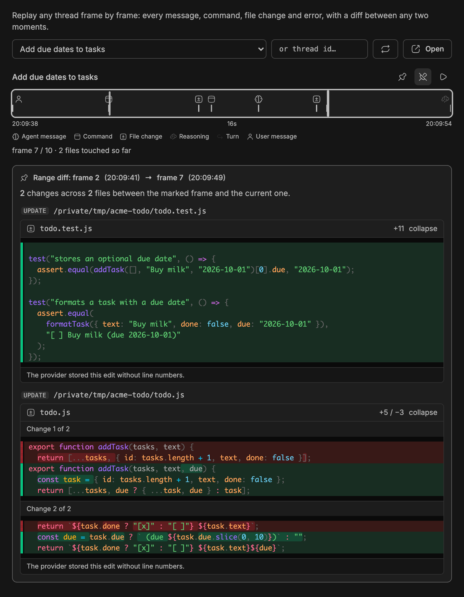
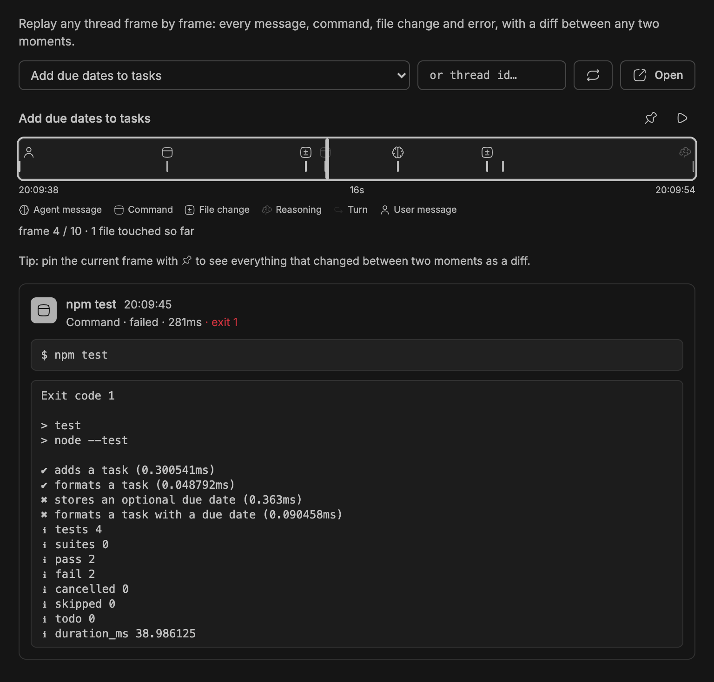
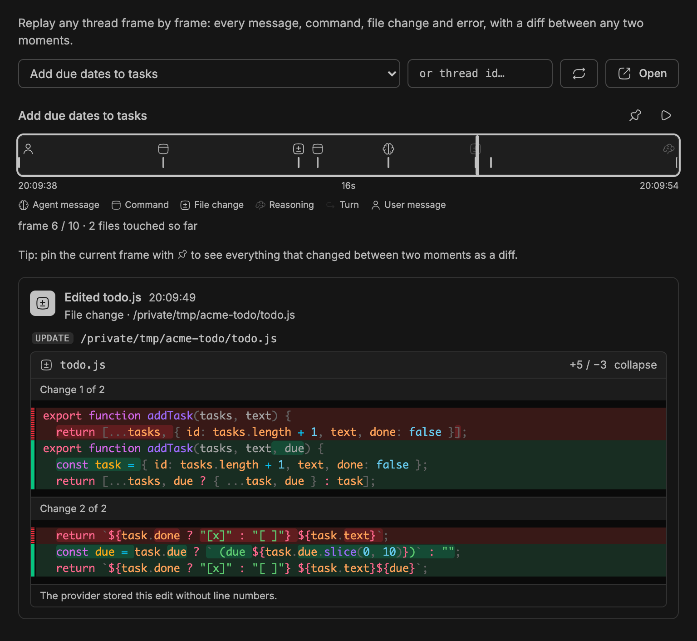
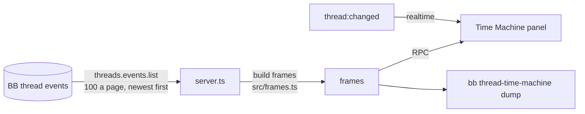

<div align="center">


# Thread Time Machine

### Replay any thread, frame by frame.

Every message, command, file change and error an agent recorded, in order.<br>
Pin two moments and see every file change between them as real diffs.


[Features](#features) · [Install](#install) · [Where to find it](#where-to-find-it) · [How it works](#how-it-works) · [CLI](#cli) · [Development](#development)

<br>



</div>

<br>

> [!NOTE]
> The screenshots are real BB captures populated with fictional demo data.

## The problem

A long agent session scrolls past faster than you can read it. When you come
back, the chat tells you what the agent said, not what it ran, which files it
touched, or where it went wrong.

Thread Time Machine turns the thread's recorded events into a filmstrip. You
drag to any moment, read exactly what happened there, and compare any two
moments as diffs. It reads the history BB already keeps, so it works on
threads that ran before you installed it.

|  | Without Thread Time Machine | With Thread Time Machine |
| --- | :---: | :---: |
| See every command, with output and exit code | ❌ | ✅ |
| Jump to any moment by time | ❌ | ✅ scrubber and ← / → keys |
| Diff the files between two moments | ❌ | ✅ |
| Same view on every agent provider | ❌ | ✅ |

## Features

<table>
<tr>
<td width="50%" valign="top">

### 🎞️ Filmstrip scrubber

Drag across the timeline, or use ← / →, to step through the session. Ticks
are coloured by kind and placed by wall-clock time. Press play to watch it
unfold.

</td>
<td width="50%" valign="top">

### 🔍 Frame inspector

Each frame shows what was recorded: the command with its output and exit
code, tool arguments and results, reasoning, messages, and file changes as
unified diffs.

</td>
</tr>
<tr>
<td valign="top">

### 📌 Diff two moments

Pin a start frame, scrub to another, and see every file change between them,
grouped by file, one diff per edit in order.

</td>
<td valign="top">

### 🧩 Every provider

Codex, Claude Code, Pi, Muse Code, Cursor, opencode, Grok and Antigravity
record events differently. Each is normalised into the same frames, including
sub-agents, compactions, stops, edits and forks.

</td>
</tr>
</table>

<div align="center">
<table>
<tr>
<td align="center"><br><sub><b>A failing command, with its output and exit code</b></sub></td>
<td align="center"><br><sub><b>A file change, one diff per change</b></sub></td>
</tr>
</table>
</div>

## Install

```sh
bb plugin install git:https://github.com/MacHatter1/bb-plugin-thread-time-machine --yes
```

That's it. **Time Machine** appears in the left sidebar.

<details>
<summary><b>Install from a local clone</b></summary>

```sh
git clone https://github.com/MacHatter1/bb-plugin-thread-time-machine
cd bb-plugin-thread-time-machine
npm install && bb plugin build
bb plugin install path:$PWD --yes
```

</details>

**Requirements**

- bb **0.43+** (Plugin SDK 0.5.9+)
- GitHub access to the private repository on the installing machine, for git installs

## Where to find it

| Where | What |
| --- | --- |
| **Sidebar → Time Machine** | Pick a thread (or type the id of a hidden one), scrub, inspect, pin and compare. |
| **`bb thread-time-machine dump`** | The same history as a condensed text timeline, for terminals and agents. |

## How it works



- **Reads BB's own history.** Events come from `threads.events.list`,
  filtered to the types the plugin uses, paged newest first up to 40,000
  events. Nothing is stored and nothing leaves your machine.
- **One frame per item.** Providers record work as item lifecycle events
  (`item/started`, deltas, `item/completed`). Each item becomes one frame in
  event order. Streamed deltas are read only for items that never completed,
  such as a stopped turn.
- **Provider differences handled.** Codex's shell-wrapped commands and
  encrypted reasoning, Antigravity's JSON command output, Muse Code's `bash`
  tool calls, Claude Code's compaction heartbeats and sub-agents, and diffs
  stored with or without hunk headers all end up in the same shape.
- **Bounded.** Messages, outputs and diffs are capped on the server. When a
  thread's command and tool output passes 2.5 million characters, each output
  is shortened to a head-and-tail preview.
- **Live.** The server forwards `thread:changed`, so an open panel refetches
  while the agent works and follows new frames if you are at the end.

## Privacy

- 🔒 **Read-only.** It never sends, edits, stops or forks a thread.
- 🏠 **Local.** No account, API key or external service; it reads the event
  history BB already keeps.

What a frame can show is limited to what the provider records. Codex stores
reasoning encrypted, and Pi (for edits), Muse Code and some Cursor edits store
no diff. A fork's own history starts at the fork: the first frame names the
source thread, which holds the earlier history.

## CLI

```sh
bb thread-time-machine dump <thread-id>              # condensed timeline, newest 200 frames
bb thread-time-machine dump <thread-id> --limit 50   # fewer frames
bb thread-time-machine dump <thread-id> --json       # frames as JSON
```

```
14:02:11  user       User message
14:02:14  command    ls && cat package.json todo.js todo.test.js
14:02:18  file       Edited todo.test.js
14:02:18  command    npm test [failed]  (exit 1)
14:02:20  agent      Both new tests fail as expected. Now the implementation:
14:02:22  file       Edited todo.js
14:02:22  command    npm test
14:02:27  agent      I added two tests to `todo.test.js`, and the first `npm test` run showed both failing (2 …
14:02:27  turn       Turn completed
```

<details>
<summary><b>All options</b></summary>

| Option | Does |
| --- | --- |
| `--limit <n>` | Keep the newest n frames. Default 200, maximum 5000. |
| `--json` | Print the frames array. Output is capped at 1 MB; older frames that do not fit are dropped and reported on stderr. |

Frame kinds: `user`, `agent`, `reasoning`, `command`, `file`, `read`,
`search`, `web`, `image`, `tool`, `task`, `plan`, `compact`, `turn`,
`system`, `warning`, `error`. A `↳` marks work inside a sub-agent, and
`[failed]`, `[incomplete]`, `[running]` or `[rejected]` flag unusual states.

</details>

The bundled [skill](skills/thread-time-machine/SKILL.md) teaches agents to
use `dump` to summarise what a thread did over a long session.

## Development

```sh
npm install
npm test
npm run typecheck
bb plugin build
bb plugin install path:$PWD --yes
bb plugin dev                      # rebuild and reload on every save
```

```
server.ts                  RPC, CLI command and live-update wiring
app.tsx                    the Time Machine panel
src/frames.ts              events → frames, for every provider
src/load.ts                paged reads through the SDK
src/diff.ts                provider diffs → one-file unified patches
src/cli.ts                 dump argument parsing and output
scripts/capture-fixture.mjs  capture a scrubbed test fixture from a thread
skills/                    the bundled agent skill
docs/                      logo and screenshots
```

**Tests** use vitest against fixtures captured from real threads on every
provider (`test/fixtures`), plus a fake events API with the real paging
rules. Capture a new fixture with
`node scripts/capture-fixture.mjs <thread-id> <name> [--from <seq>] [--to <seq>]`.
It scrubs home paths, the username, emails and tokens; add
`--redact <text>` for anything else private.

`PLUGIN_OVERVIEW.md` is the store listing. Keep it in step with
`bb.description` in `package.json`.

## Licence

[MIT](LICENSE)
